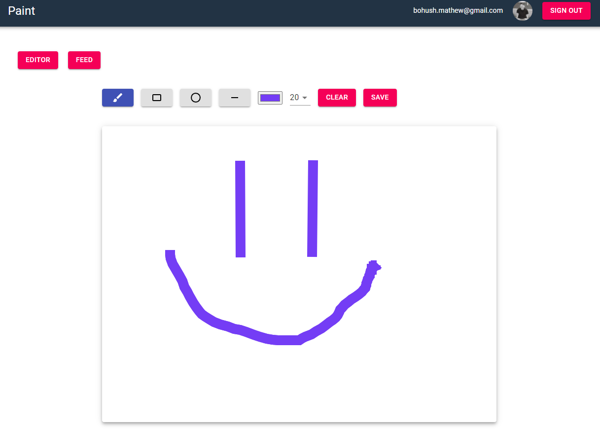

# Innowise Paint

 Simple drawing app like Windows Paint. 

## Task description

Here you can read all task [requirements](https://docs.google.com/document/d/1feIA0eu0NkR4J2mCdCc8oPErbET--IlqAEoSpRo1KHA/edit).

## Link to the app

You can follow this [link](https://xxxzez.github.io/Innowise-Lab-Internship-Level-2-Mini-paint) and see how this app looks like.


## Application stack
- React (functional components with hooks)
- Redux, Redux-Saga
- Typescript
- Firebase (Cloud Firestore)
- Material-UI
- Canvas


## Installation

Clone this [repository](https://github.com/xxxzez/Innowise-Lab-Internship-Level-2-Mini-paint) and run:

```bash
npm install
```
or
```bash
git clone https://github.com/xxxzez/Innowise-Lab-Internship-Level-2-Mini-paint.git

npm install
```

## Usage

```python
# build a production version
npm run build

# run a development version
npm run start
```

## Firebase Structure

```bash
└──users
    |──userId        
        ├── email             
        ├── profilePhoto
        ├── userId

└──images                  
    ├──imageId
        ├──date
            ├──imageId
            ├──imagePath
            ├──imageURL
            ├──userEmail

```

<!-- ## File Structure

 -->
